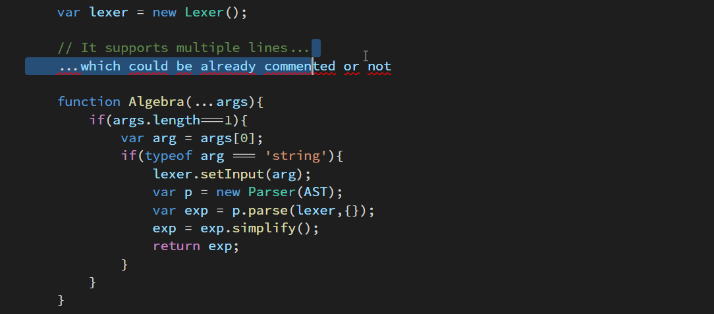

# box-comment README

This simple extension created decorative boxed-out comments for your source code.

### How to use

Use Command Palette and type "box comment"
Use the provided key binding `Alt+Shift+B`

## Extension Settings

This extension contributes the following command:

* `extension.boxCommand`: wraps the currently selected lines with a decorative box comment

This extensions contributes the following key binding:
* `Alt+Shift+B`: invoke the `extension.boxCommand` command.

